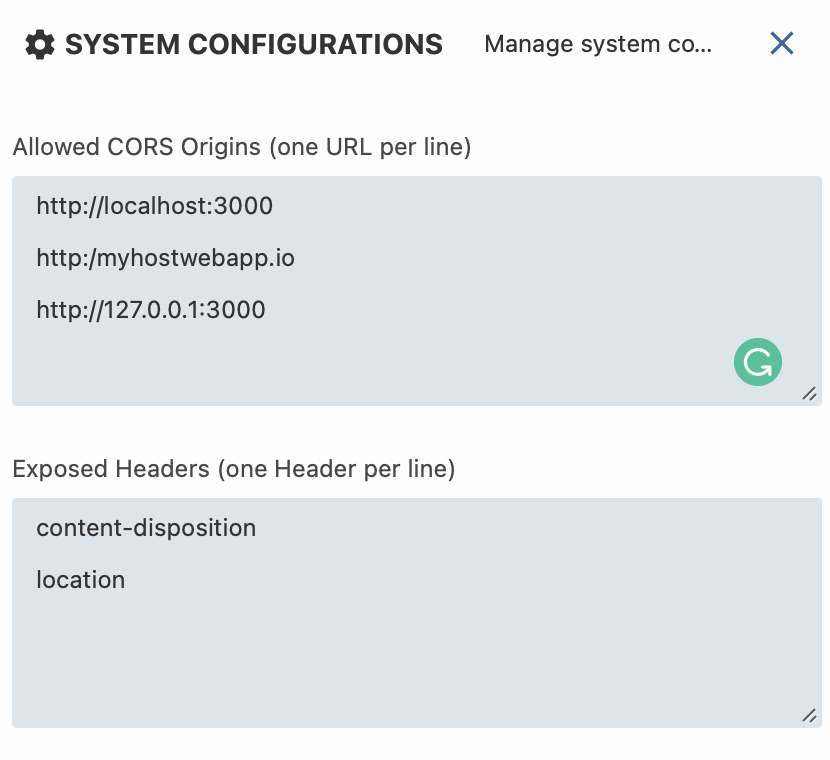

# Wyn Designer Sample

This sample demonstrates how to embed Wyn Enterprise's ActiveReports (WynDesigner and Wyn Report Viewer) into a React application and connect them to a Wyn portal for editing and viewing reports.

## System requirements

This sample requires:
 * [Node.js](https://nodejs.org/en/download/)
 * [Wyn Enterprise](https://www.wynenterprise.com/try-wyn-for-free/30-day-wyn-trial/)
## Build and run the sample

### Description

We download the given packages and update reporting sample packages. After we compile the sample and run it.

### Steps to run the sample

1. Run command `npm install` to install all required modules
2. Run `npm update @wynenterprise/wyn-report-viewer --latest` to update the latest wyn-report-viewer build.
3. Run `npm update @wynenterprise/wyn-report-designer --latest` to update the latest wyn-report-designer build.
4. Run `npm run start` to start the development server (http://localhost:3000)

### Wyn Enterprise System Configurations for API usage
1. In the Administrator Portal after installing Wyn Enterprise, open the System Configuration Page. 
2. Set http://localhost:3000 (or the host application URL) in the "Allowed CORS Origins" section. 
3. Set 'content-disposition' and 'location' in the "Exposed Headers" section. 

After configuration, the System configuration page should look like the image below: 

### Documentation

- [Developer Documentation](https://learn.wynenterprise.com/docs/dev-docs)
- [Embedding Wyn Report Viewer and Designer Using Div Tags](https://learn.wynenterprise.com/docs/dev-docs/Embed-Wyn-Enterprise-into-Web-Applications/Embedding-Designer-Viewer-Using-Div)